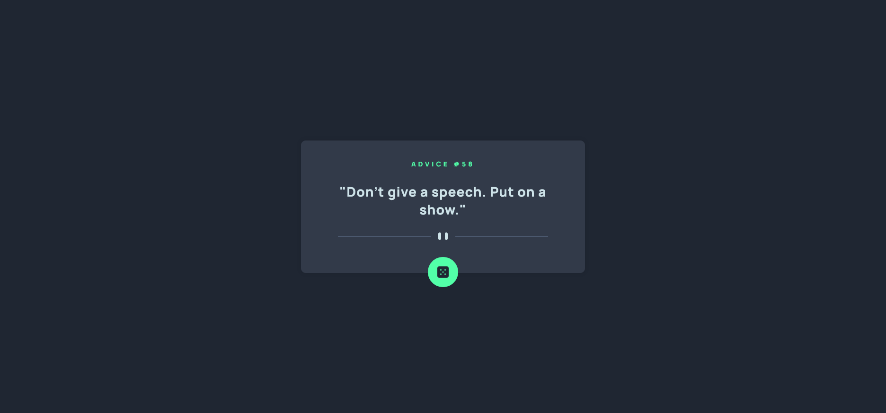

# Frontend Mentor - Interactive rating component solution

This is a solution to the [Interactive rating component challenge on Frontend Mentor](https://www.frontendmentor.io/challenges/interactive-rating-component-koxpeBUmI). Frontend Mentor challenges help you improve your coding skills by building realistic projects.

## Table of contents

- [Frontend Mentor - Interactive rating component solution](#frontend-mentor---interactive-rating-component-solution)
  - [Table of contents](#table-of-contents)
  - [Overview](#overview)
    - [The challenge](#the-challenge)
    - [What I learned](#what-i-learned)
    - [What Can I do to improve this further?](#what-can-i-do-to-improve-this-further)
    - [Screenshot](#screenshot)
    - [Links](#links)
    - [Built with](#built-with)
- [Author](#author)

## Overview

### The challenge

Users should be able to:

- View the optimal layout for the app depending on their device's screen size
- See hover states for all interactive elements on the page
- Select and submit a number rating
- See the "Thank you" card state after submitting a rating

### What I learned

I learned about clamp() in CSS. Its such a cool property. It basically set min/max of the font-size with just one line of CSS. According to MDN it takes in 3 parameters: min, preferred, and max value. This is great for responsive design because it'll up/down bas on the size of the viewport.

I made an error while I was doing the HTML markup by putting the dice inside a form. By doing this, it actually prevented the dice from constantly generating the quote which is what I want. I wanted the quote to generate each time the button is clicked. When I realized what I did I took out the form and it works as I wanted.

### What Can I do to improve this further?

I think I can push this little more. The quote itself will auto generate every few seconds using setTimeOut(). Maybe a button to stop/play the quote.

### Screenshot

### Links

- Solution URL: [Add solution URL here](https://github.com/Nghuynh07/3-column-preview-card-component)
- Live Site URL: [Add live site URL here](https://6268d9933f323459f88242f7--glowing-strudel-c28f1b.netlify.app/)

### Built with

- Semantic HTML5 markup
- CSS custom properties
- CSS flexbox
- Mobile-first workflow
- SASS

# Author

- Website - [Huynh Nguyen](https://huynhtn.com/)
- Frontend Mentor - [@Nghuynh07](https://www.frontendmentor.io/profile/Nghuynh07)
- Twitter - [@huyniewin](https://twitter.com/huyniewin)
